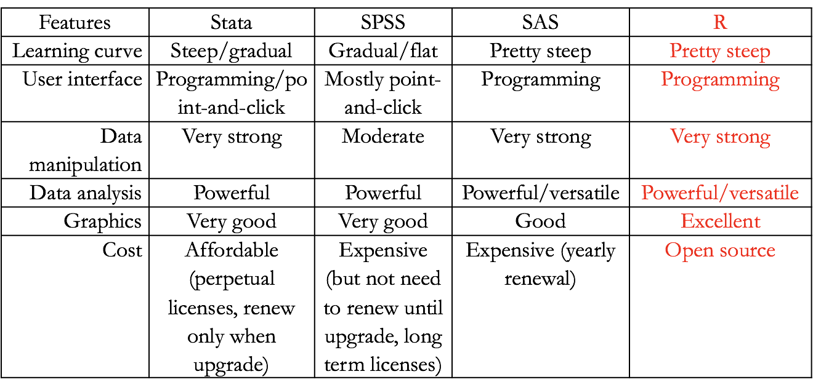

# R Programming

## What is R?

The R statistical programming language is a free, open source package based on the S language developed by John Chambers.

### Some history of R and S

S was further developed into R by Robert Gentlemen (Canada) and Ross Ihaka (New Zealand)

```{r Rinventors, echo=FALSE, fig.cap="R Inventors", out.width = '100%'}
knitr::include_graphics("Rinventors.png")
```
Source: [Nick Thieme. 2018. R Generation: 25 years of R](https://rss.onlinelibrary.wiley.com/doi/10.1111/j.1740-9713.2018.01169.x) 

### It is:

- Large, probably one of the largest based on the user-written add-ons/procedures
- Object-oriented
- Interactive
- Multiplatform: Windows, Mac, Linux

According to John Chambers (2009), six facets of R:

1. an interface to computational procedures of many kinds;
2. interactive, hands-on in real time;
3. functional in its model of programming;
4. object-oriented, “everything is an object”;
5. modular, built from standardized pieces; and,
6. collaborative, a world-wide, open-source effort. 

```{r Rdevelopers, echo=FALSE, fig.cap="Prominent R Developers", out.width = '100%'}
knitr::include_graphics("Rdevelopers.png")
```
Source: [Nick Thieme. 2018. R Generation: 25 years of R](https://rss.onlinelibrary.wiley.com/doi/10.1111/j.1740-9713.2018.01169.x) 

## Why R?

- A programming platform environment
- Allow development of software/packages by users
- Currently, the CRAN package repository features over 14,000 available packages (as of May, 2019).
- Graphics!!!
- Scaleble and Portable 
- Interface with other platform/langauges (e.g. C++, Python, JavaScript, Stan, SQL)
- Comparing R with other software?

```{r Rcompare, echo=FALSE, fig.cap="R Compared with other statistical programs/platforms", out.width = '100%'}

```
Source: Oscar Torres-Reyna. 2010. [Getting Started in R~Stata Notes on Exploring Data](https://dss.princeton.edu/training/RStata.pdf) 


## RStudio

RStudio is a user interface for the statistical programming software R.

- Object-based environment
- Window system
- Point and click operations
- Coding recommended                                   
- Expansions and development
- a multi-functional Integrated Development Environment (IDE) 

```{r Rstudioscreenshot, echo=FALSE, fig.cap="RStudio screenshot", out.width = '100%'}
knitr::include_graphics("RStudioscreenshot.png")
```

## Basic operations and object assignment

Arithmetic Operations:

+, -, *, /, ^ are the standard arithmetic operators.

Assignment

To assign a value to a variable use “<-” or “=”:

```{r message=FALSE, warning=FALSE}
## Introduction to R sample program 
## file: introR02.R
## Adapted from Venables, W.N., Smith, D.M. and Team, R.C., 2018. An Introduction to R, Version 3.5.1 (2018-07-02)


# Clear any existing objects 
rm(list = ls())

# Generate x, y and w to demontrate linear models and plots.
# Make x = (1,2,...,20).

x <- 1:20

# Create A ‘weight’ vector of standard deviations.

w <- 1 + sqrt(x)/2

# Create a data frame of two columns, x and y.

dummy <- data.frame(x=x, y= x + rnorm(x)*w)

# Fit a simple linear regression 
# With y to the left of the tilde then x, meaning y being dependent on x.
# Unlike other statistical packages, R does not display all output.  It is recommended
# to create an object to store the estimates.

fm <- lm(y ~ x, data=dummy) 

# Display the summary of the output of model fm.

summary(fm)

# Use w for a weighted regression.

fm1 <- lm(y ~ x, data=dummy, weight=1/w^2) 

# Display the summary of the output of model fm1.

summary(fm1)

# Make the columns in the data frame visible as variables.

attach(dummy)

# Make a nonparametric local regression function. 

lrf <- lowess(x, y)

# Standard point plot, with plotting character (pch) as bullet.

plot(x, y,pch=20) 

# Add in the local regression.

lines(x, lrf$y)

# The true regression line: (intercept 0, slope 1, with dotted line type )

abline(0, 1, lty=3)

# Unweighted regression line.

abline(coef(fm))

# Weighted regression line.

abline(coef(fm1), col = "red")

# A standard regression diagnostic plot to check for heteroscedasticity. Can you see it?

plot(fitted(fm), pch=20, resid(fm), xlab="Fitted values", ylab="Residuals", main="Residuals vs Fitted")

# How about now?

abline(0,0, col="red")  

# A normal scores plot to check for skewness, kurtosis and outliers.

qqnorm(resid(fm), main="Residuals Rankit Plot", pch=17)

# Cleaning up

rm(list = ls())
```

## Illustration

In this section, we demonstrate exploring data about Taiwan elections in 2016.  The Taiwan Election and Democratization Study (TEDS) is one of the longest and most comprehensive elections studies starting in 2001.  TEDS collects data through different modes of surveys including face-to-face interviews, telephone interviews and internet surveys.  More detail of TEDS can be found at the National Chengchi University Election Study Center website at [https://esc.nccu.edu.tw/main.php](https://esc.nccu.edu.tw/main.php).

*Taiwan Election and Democratization Study 2016 data*

```{r}
# Import the TEDS 2016 data in Stata format using the haven package
##install.packages("haven")

library(haven)
TEDS_2016 <- haven::read_stata("https://github.com/datageneration/home/blob/master/DataProgramming/data/TEDS_2016.dta?raw=true")

# Prepare the analyze the Party ID variable 
# Assign label to the values (1=KMT, 2=DPP, 3=NP, 4=PFP, 5=TSU, 6=NPP, 7="NA")

TEDS_2016$PartyID <- factor(TEDS_2016$PartyID, labels=c("KMT","DPP","NP","PFP", "TSU", "NPP","NA"))
```

Take a look at the variable:

```{r}
# Check the variable
attach(TEDS_2016)
head(PartyID)
tail(PartyID)
```

Frequency table:
```{r}
# Run a frequency table of the Party ID variable using the descr package
## install.packages("descr")
library(descr)
freq(TEDS_2016$PartyID)
```

Get a better chart of the Party ID variable:
```{r message=TRUE, warning=TRUE}
# Plot the Party ID variable
library(ggplot2)
ggplot(TEDS_2016, aes(PartyID)) + 
  geom_bar()
```

We can attend to more detail of the chart, such as adding labels to x and y axes, and calculating the percentage instead of counts.


```{r echo=TRUE}
ggplot2::ggplot(TEDS_2016, aes(PartyID)) + 
  geom_bar(aes(y = (..count..)/sum(..count..))) + 
  scale_y_continuous(labels=scales::percent) +
  ylab("Party Support (%)") + 
  xlab("Taiwan Political Parties")
```

Adding colors, with another theme:

```{r}
ggplot2::ggplot(TEDS_2016, aes(PartyID)) + 
  geom_bar(aes(y = (..count..)/sum(..count..),fill=PartyID)) + 
  scale_y_continuous(labels=scales::percent) +
  ylab("Party Support (%)") + 
  xlab("Taiwan Political Parties") +
  theme_bw()
```

Hold on, colors are not right!

```{r}
ggplot2::ggplot(TEDS_2016, aes(PartyID)) + 
  geom_bar(aes(y = (..count..)/sum(..count..),fill=PartyID)) + 
  scale_y_continuous(labels=scales::percent) +
  ylab("Party Support (%)") + 
  xlab("Taiwan Political Parties") +
  theme_bw() +
  scale_fill_manual(values=c("steel blue","forestgreen","khaki1","orange","goldenrod","yellow","grey"))

```

To make the chart more meaningful, we can use a package called tidyverse to manage the data.  

```{r message=FALSE, warning=FALSE}
##install.packages("tidyverse")
library(tidyverse)
TEDS_2016 %>% 
  count(PartyID) %>% 
  mutate(perc = n / nrow(TEDS_2016)) -> T2
ggplot2::ggplot(T2, aes(x = reorder(PartyID, -perc),y = perc,fill=PartyID)) + 
  geom_bar(stat = "identity") +
  ylab("Party Support (%)") + 
  xlab("Taiwan Political Parties") +
  theme_bw() +
  scale_fill_manual(values=c("steel blue","forestgreen","khaki1","orange","goldenrod","yellow","grey"))


```

## Recommended R Resources:

- [The R Journal](http://journal.r-project.org/)
- [Introduction to R by W. N. Venables, D. M. Smith and the R Core Team](http://cran.r-project.org/doc/manuals/R-intro.pdf)
- [Introduction to R Seminar at UCLA](http://www.ats.ucla.edu/stat/r/seminars/intro.htm)
- [Getting Started in Data Analysis using Stata and R by Data and Statistical Services, Princeton University](https://dss.princeton.edu/training/)
