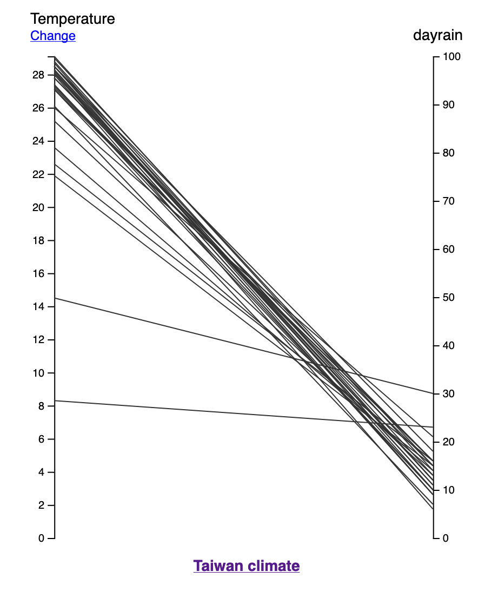

# JavaScript

## What is JavaScript?
```{r JavaScriptinventor, echo=FALSE, fig.cap="JavaScript Inventor Brendan Eich", out.width = '25%',fig.align="right"}

```
- JavaScript is not related to Java
- Created by Brendan Eich in 1995
- Originally developed as a prototype language for web browser (Client-side).
- Now used in server-side (Node.js) as well.
- Not related to Java, just named similarly for marketing purpose.
- C style syntax but got inspiration from Functional programming
- for, while, continue, break, if/else, switch are similar to C
- operators (+,-,*,/,%) are also similar (except ==,!=,||)
- include function operations such as map, reduce, forEach.

### JavaScript Data Types

Data Types

- Numbers: 42, 3.14159
- Logical: true, false
- Strings: "Hello", 'Taiwan'
- null
- undefined* - undefined is not null!

### JSON

- JavaScript Object Notation
- JavaScript as an XML alternative for storing data
- e.g.

[{"Station":"Alishan","Temperature":14.5,"Precipitation":812.4,"Humidity":95,"Pressure":762.5,"dayrain":30},....]


## What is D3?

- D3 stands for Data-Driven Documents.
-d3.js (D3) is “a JavaScript library for manipulating documents based on data”. 
- D3 can be used in conjunction  with HTML and CSS (amongst others) to visualize data on a webpage.
- It’s an open framework.
- It embeds or includes data in scripts to create images in webpages.

> "With D3, designers selectively bind input data to arbitrary document elements, applying dynamic transforms to both generate and modify content." 
>
> ---[Bostock, Ogievetsky and Heer, 2011](https://data3.mprog.nl/course/15%20Readings/60%20Reading%206/Bostock_D3.pdf)

### D3 and web documents

- D3 is web-based, working with following components:
  - HTML (Hypertext Markup Language)
  - CSS (Cascade Style Sheet)
  - JavaScript(js) 
  - SVG (Scalable Vector Graphics), interpreted graphic output
  
All of the above can be coded using a text editor.  Output needs a browser with JavaScript console 

### Sample D3 graphics 

Interactive Ladder Graph
```{r D3laddergraph, echo=FALSE, fig.cap="D3: Ladder graph", out.width = '50%'}

```
Click [here](https://karl-ho.github.io/D3/lg_twclimate/index.html) to access the online version


Interactive Aster Graph
```{r D3astergraph, echo=FALSE, fig.cap="D3: Aster graph", out.width = '50%'}
knitr::include_graphics("astergraph_twhkdemocracy.png")
```
Click [here](https://www.utdallas.edu/~kyho/present/aster/lpm.html) to access the online version

[Interactive Network Graph](https://karl-ho.github.io/D3/createnetwork/index.html)
